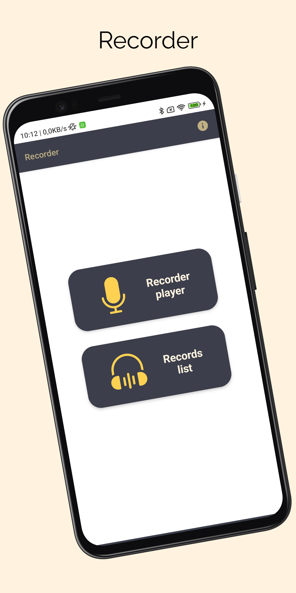

# Recorder
> <b>Author: Nicola De Nicolais</b>

##  📄  Description
Android application built with Kotlin and Jetpack Compose that shows how to record the input voice and save it in .mp3 files.<br/>
The app use MediaRecorder that in Android is used for recording audio or video, there is a built-in class called MediaRecorder.
The Android multimedia framework provides built-in support for capturing and encoding common audio and video formats.<br/>
These are some parameters that can be changed:

```
setAudioSource()      # This method will specify the source of the audio to be recorded.
setAudioEncoder()     # This method is used to specify the audio encoder.
setOutputFormat()     # This method is used to specify the output format of our audio.
setOutputFile()       # This method is used to specify the path of recorded audio files that are to be stored.
```

Functions associated with the MediaRecorder class:

```
stop()       # This method is used to stop the recording process. When called, it stops the ongoing recording and saves the recording file.
start()      # This method is used to start the recording process. When called, it begins recording audio or video, depending on the configuration of the MediaRecorder.
pause()      # This method is used to pause the recording process. When called, it temporarily suspends the recording without interrupting the current recording file. It can be used to resume the recording later.
resume()     # This method is used to resume the recording process after it has been paused using the pause() method. When called, the recording resumes from where it was paused.
release()    # This method is used to release the resources associated with the MediaRecorder class. When called, it frees up resources such as the microphone or camera that were acquired for recording.
```

## 🔨  How to install and run the project
Clone this repository :<br/>
`
git clone https://github.com/ndenicolais/Recorder.git
`

Import the project into Android Studio :

1. File -> New -> Import Project
2. Browse to <path_to_project>
3. Click "OK"

Create a new virtual device or connect an Android device to your computer.</br>
Click Run to start the project on the selected device.

## 🛠️ Built with
Kotlin</br>
Jetpack Compose</br>
Navigation

## 📚 Package Structure

```
com.denicks21.recorder          # Root Package
│ 
├── navigation                  # NAVIGATION FOLDER
│   ├── NavGraph                # Contains all of app destinations and actions.
│   └── NavScreens              # Contains a sealed class with object corresponds to a screen and its routes.
|
├── play                        # PLAYER FOLDER
│   ├── AudioInterface          # Interface of audio player.
|   ├── AudioPlayer             # Audio player.
|
├── record                      # RECORDER FOLDER
│   ├── RecorderInterface       # Interface of recorder player.
|   ├── RecorderPlayer          # Recorder player.
|
├── screen                      # SCREEN FOLDER
|   │   ├── AudioPlayerPage     # Listen last record.
|   │   ├── HomePage            # Main page of the app.
|   │   ├── IntroPage           # Splashscreen of the app.
|   │   ├── RecorderPlayerPage  # Start a new record.
│
├── ui                          # UI FOLDER
│   ├── composables             # Composable components folder
|   │   ├── BackPress           # Component that control and prevent back button action.
|
├── theme                       # THEME FOLDER
|   │   ├── Color               # Color palette used by the app.
|   │   ├── Shape               # Components shapes of Compose used by the app.
|   │   ├── Theme               # Theme used by the app.
|   │   ├── Type                # Typography styles for the fonts used by the app.
|
├── MainActivity                # Main activity
```

## 📎 Screenshots
<p float="left">

