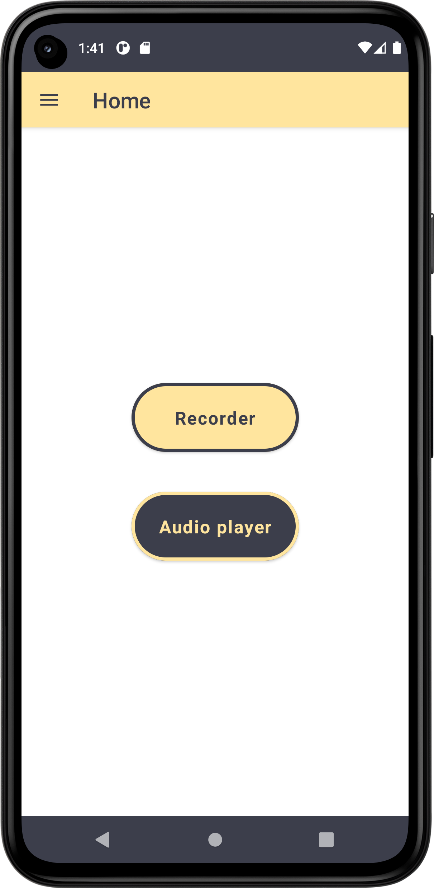
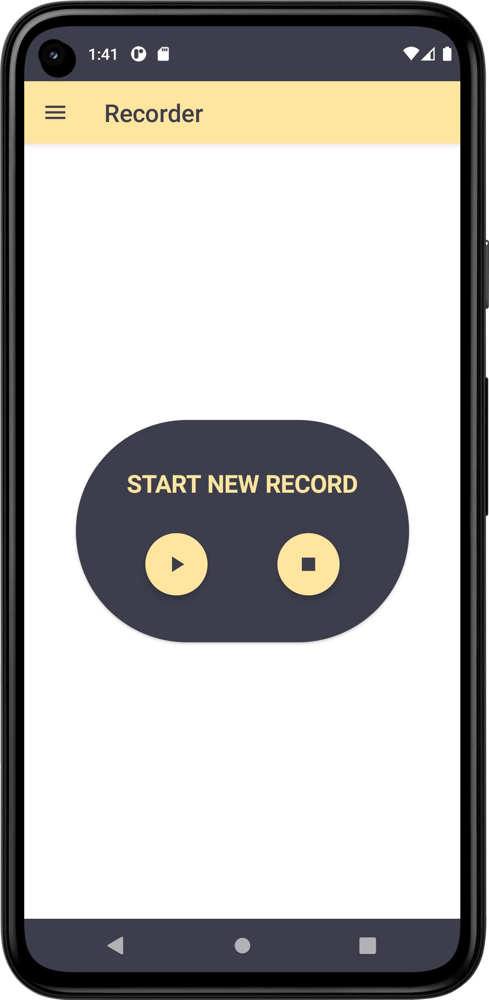
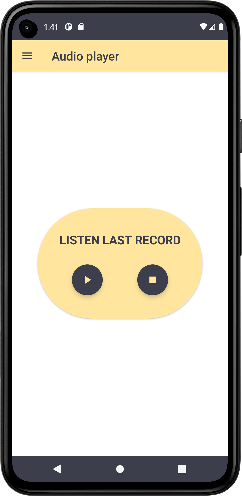

# ComposeRecorder
> <b>Author: Nicola De Nicolais</b>

## 📍 Description
Android application built with Kotlin and Jetpack Compose that shows how to record the input voice and save it in .mp3 files.<br/>
The app use MediaRecorder that in Android is used for recording audio or video, there is a built-in class called MediaRecorder.
The Android multimedia framework provides built-in support for capturing and encoding common audio and video formats.<br/>
These are some parameters that can be changed:

```
setAudioSource()      # This method will specify the source of the audio to be recorded.
setAudioEncoder()     # This method is used to specify the audio encoder.
setOutputFormat()     # This method is used to specify the output format of our audio.
setOutputFile()       # This method is used to specify the path of recorded audio files that are to be stored.
stop()                # This method is used to stop the recording process. 
start()               # This method is used to start the recording process. 
release()             # This method is used to release the resource that is associated with the Media recorder class.
```

## ⚡ Structure
### Jetpack Compose
#### Navigation

Navigation refers to the interactions that allow users to navigate across, into, and back out from the different pieces of content within your app. Android Jetpack's Navigation component helps you implement navigation, from simple button clicks to more complex patterns, such as app bars and the navigation drawer.


## 🛠️ Package Structure

```
com.denicks21.recorder          # Root Package
│ 
├── navigation                  # Navigation folder
│   ├── NavGraph                # Contains all of app destinations and actions.
│   └── NavScreens              # Contains a sealed class with object corresponds to a screen and its routes.
|
├── play                        # AudioPlayer folder
│   ├── AudioInterface          # Interface of audio player.
|   ├── AudioPlayer             # Audio player.
|
├── record                      # RecorderPlayer folder
│   ├── RecorderInterface       # Interface of recorder player.
|   ├── RecorderPlayer          # Recorder player.
|
├── screen                      # App screens folder
|   │   ├── AudioPlayerPage     # Listen last record.
|   │   ├── HomePage            # Main page of the app.
|   │   ├── RecorderPlayerPage  # Start a new record.
|   │   ├── InfoPage            # Page containing information about the app and developer profile.
|   │   ├── IntroPage           # Splashscreen of the app.
│
├── ui                          # UI resources folder
│   ├── composables             # Composable components folder
|   │   ├── BackPress           # Component that control and prevent back button action.
|   │   ├── NavigationDrawer    # Navigation drawer menu with app screens.
|   │   ├── TopBar              # Bar that represent the app name and drawer menu.
|
├── theme                       # Theme components folder
|   │   ├── Color               # Color palette used by the app.
|   │   ├── Shape               # Components shapes of Compose used by the app.
|   │   ├── Theme               # Theme used by the app.
|   │   ├── Type                # Typography styles for the fonts used by the app.
|
├── MainActivity                # Main activity
```

## 📎 Screenshots
<p float="left">



